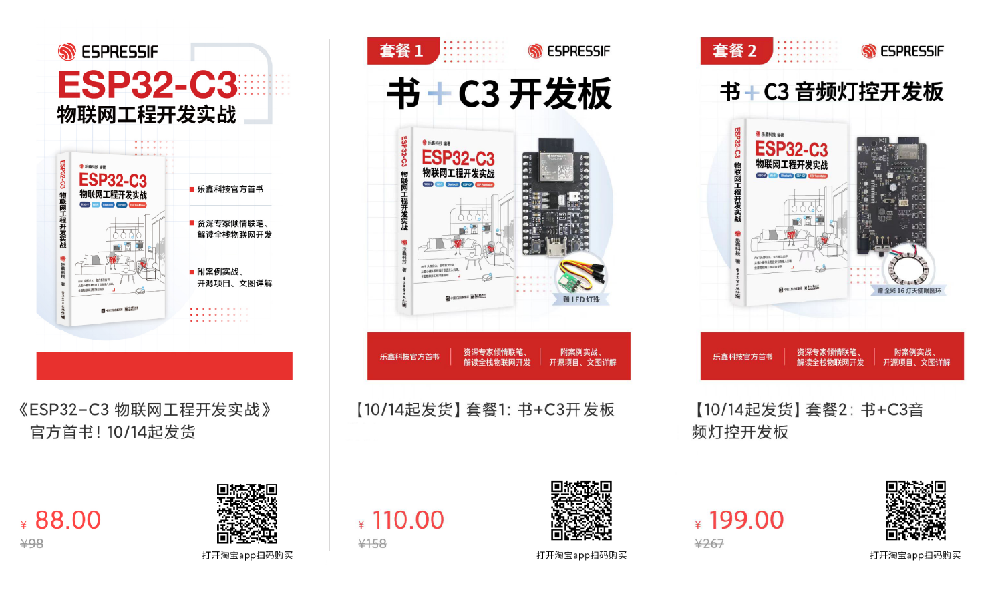

# 《ESP32-C3 物联网工程开发实战》书籍开源项目

《ESP32-C3 物联网工程开发实战》是乐鑫官方首次书籍。本书以ESP32-C3为硬件基础、ESP-IDF为软件框架、循序渐进地剖析了开发环境搭建、无线射频硬件设计、驱动开发、网络配置和连接、ESP RainMaker一站式AIoT云平台等知识。

本仓库为该书配套的智能灯实战项目。

# 购买方式
* [单独购书](https://item.taobao.com/item.htm?spm=a1z10.5-c.w4002-8715811636.11.2b5253e7vz8kFi&id=684644148433)
* [套餐1](https://item.taobao.com/item.htm?spm=a1z10.5-c.w4002-8715811636.11.2c6b6b68YIWrTQ&id=684646384355)
    * 书
    * ESP32-C3-DevKitM-1开发板 <br/> _另赠送本书配套的实战案例中的RGB模块单片机开发小板加杜邦线、可用来模拟智能灯具，学习LED PWM编程等相关知识。_
* [套餐2](https://item.taobao.com/item.htm?spm=a1z10.5-c.w4002-8715811636.11.1a735d4dQyRIJA&id=684989813649)
    * 书
    * [ESP32-C3-Lyra 音频灯控开发板](https://espressif-docs.readthedocs-hosted.com/projects/esp-adf/zh_CN/latest/design-guide/dev-boards/user-guide-esp32-c3-lyra-v2.0.html)<br/> _另赠送全彩16灯的天使眼圆环LED。规格：16位环形WS2812B串行全彩LED模块、5V单点可控编程。_<br/>
    更多资料参考：[LED 像素显示示例代码](https://github.com/espressif/esp-adf/blob/master/examples/display/led_pixels/README_CN.md)

打开手机淘宝App，扫码下图中二维码


仓库目录结构：
```

├── phone_app               /* 该文件夹包含项目中所用手机 App 的源码，根据 Android 和 IOS 两个操作系统，分为两个文件夹 */
│   ├── app_android
│   ├── app_ios
├── device_firmware         /* 该文件夹包含项目中的嵌入式软件部分源码，根据开发功能/步骤分为 7 个项目文件夹，和一个公用组件文件夹 */
│   ├── 1_blink
│   ├── 2_light_drivers
│   ├── 3_wifi_connection
│   ├── 4_network_config
│   ├── 5_rainmaker
│   ├── 6_project_optimize
│   ├── 7_insights
│   └── components
└── test_case               /* 该文件夹包含书中提到的一些测试用例 */
```
## 功能

本项目中的“智能灯”硬件拥有一个实体按钮和五路 PWM 信号输出端，可实现以下常见功能：

- 可以用户在家庭 Wi-Fi 网络环境中，通过手机 App（苹果/安卓）进行配置；
- 可以通过手机 App，打开/关闭灯；
- 可以通过实体按钮，打开/关闭灯；
- 可以通过云端，远程打开/关闭灯；
- 支持 OTA 固件升级；

在实际开发中，您仅需将本项目中的“智能灯”替换为您的设备驱动程序（插座、洗衣机）即可。

## 硬件环境

准备工作：

- ESP32-C3 系列的开发板
- RGB 灯模块等

## 开发环境搭建

- 按照 [ESP-IDF 快速入门指南](https://docs.espressif.com/projects/esp-idf/en/v4.3.2/esp32c3/get-started/index.html)，搭建开发环境。

> 注意，请使用 ESP-IDF v4.3.2 版本。您可以直接使用以下命令，获得 ESP-IDF v4.3.2。
> 如果您访问 GitHub 较慢，请使用 Gitee，本书对应的工程也有相应的 [Gitee 仓库](https://gitee.com/EspressifSystems/book-esp32c3-iot-projects)。重要：Gitee 中 ESP-IDF 仓库的使用，请先参看 https://gitee.com/EspressifSystems/esp-gitee-tools 中的说明文档。

```
$ git clone --recursive https://github.com/espressif/esp-idf.git
$ cd esp-idf
$ git checkout v4.3.2
$ . ./install.sh
$ ./export.sh
```

获取 RainMaker：

```
$ cd ../
$ git clone https://github.com/espressif/esp-rainmaker.git
$ export RAIMAKER_PATH=</path/to/esp-rainmaker/>
```

获取 ESP32C3-Light：

```
$ git clone https://github.com/espressif/book-esp32c3-iot-projects.git
```

编译、烧录、监视：

```
$ cd </path/to/esp-light>/<path/to/example>
$ idf.py -p /dev/ttyUSBx -b 460800 flash monitor
```

> 请注意替换路径和 USB 端口号。

## 技术支持和反馈

请使用以下反馈渠道：
* 批量采购、开票、咨询等可发邮件至 book@espressif.com
* 技术问题请到 [《ESP32-C3 物联网工程开发实战》书籍讨论版](https://www.esp32.com/viewforum.php?f=47)
* 对于功能请求或错误报告，请创建 [GitHub 问题](https://github.com/espressif/book-esp32c3-iot-projects/issues)

我们会尽快回复您。
